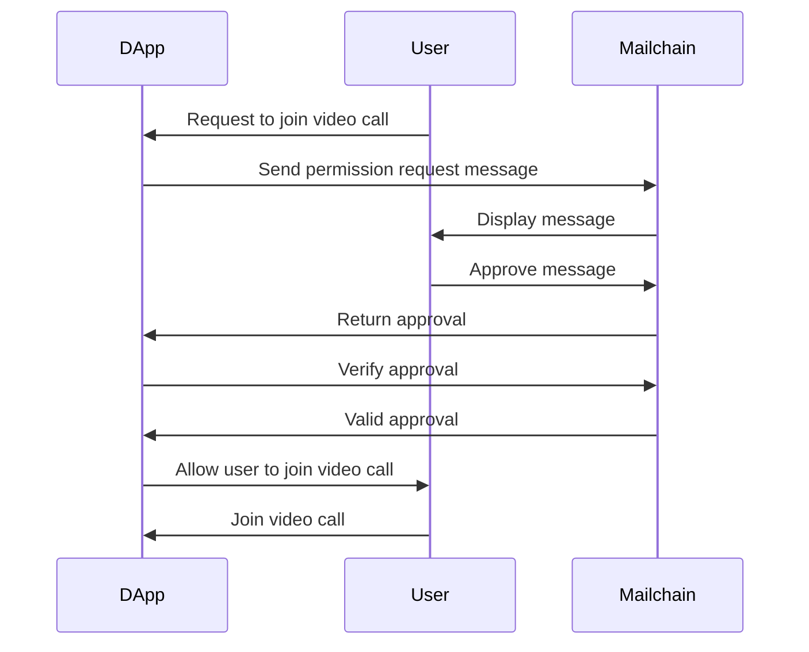
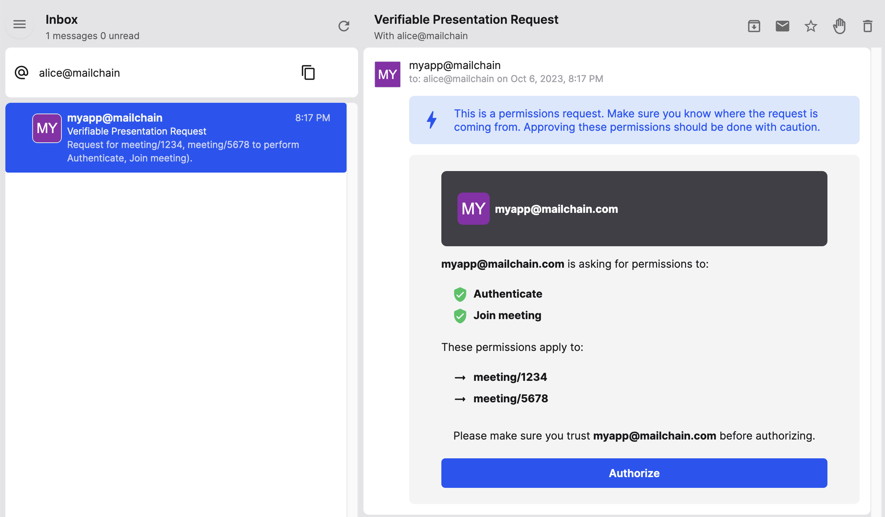

# Permission Request

This demos how to request permissions using Mailchain. This folder contains an example function for requesting permissions and an example application to verify permissions have been granted correctly.

The flow diagram below explains shows the flow for how this works.



## Setup

Install dependencies with `npm install` or `yarn install`.

Run `touch .env.development.local` to create `.env.development.local` file.

Edit `.env.development.local` to include the following environment variables

```
APP_PRIVATE_MESSAGING_KEY=Private messaging key that matches the FROM address see.
FROM=Mailchain address that the request is sent from, use the address that belongs to APP_PRIVATE_MESSAGING_KEY
TO=Mailchain address where the permissions request is sent to
```

Note: You can get access your private messaging keys via the [web app](https://docs.mailchain.com/developer/advanced/private-messaging-key/#from-web) or [through code](https://docs.mailchain.com/developer/advanced/private-messaging-key/#from-code).

## Request

Run `yarn request` to send a random request using the settings in `.env.development.local`.

Look at `src/request.ts` to see what permissions are requested.

One the request is sent it will now appear in the `TO` address users Mailchain inbox.

## Verify

Once you have sent a permission request, run `yarn server` this runs a simple server that verifies the request.

## Approve

From the Mailchain inbox, find the permissions request similar to the image below.



Once you click approve,. you'll be redirected to the sample application and there you can see the result.
